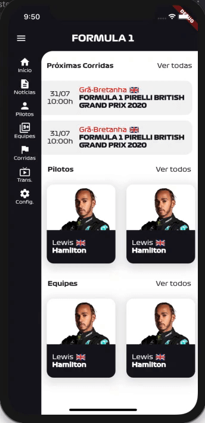

# Formula One App

Esse projeto está sendo desenvolvido afim de estudos e você pode acompanhar ao vivo no canal 
[https://twitch.tv/lukitaduarte](twitch.tv/lukitaduarte)

O intuito desse projeto é criar um aplicativo do zero para estudos de UI, performance e arquitetura do Flutter.

 - [O que será feito?](#o-que)
 - [Como será feito?](#como)
 - [Ambiente](#ambiente)

## O que será feito? 
 - [x] Home Screen
 - [x] Drivers and Teams Detail Screen
 - [ ] Race Screen
 - [ ] News Screen / News Detail Screen
 - [ ] Config. Screen
 - [ ] Design System
 - [ ] Internationalization
 - [ ] Modularization
 - [ ] Caching
 - [ ] CI/CD
 - [ ] Publication
 
 ## Como será feito? 
  A ideia é implementar uma arquitetura de State Management como Bloc, Mobx ou Redux. 
  Utilizar-se amplamente de abstrações e design patterns como como repository, factory, builder, strategy para tirar o maior proveito de recurso dos devices. 
  Aprender afundo o funcionamento da arvore de widgets do flutter e testar o catálogo de widgets disponíveis.

## Ambiente 

    Flutter 1.20.0 • channel stable • https://github.com/flutter/flutter.git
    Framework • revision 840c9205b3 (20 hours ago) • 2020-08-04 20:55:12 -0700
    Engine • revision c8e3b94853
    Tools • Dart 2.9.0
